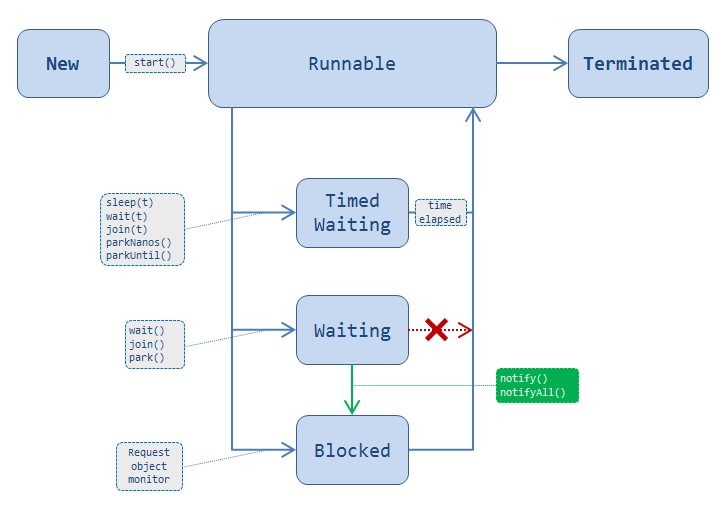

# 多线程基础

## 线程状态
通过jdk的源码可以看出Thread.state定义了6种状态：
`New`,`RUNNABLE`,`BLOCKED`,`WAITING`,`TIMED_WAITING`,`TERMINATED`。

### 线程状态转换图


### 各状态详细解释
1. New(新建状态): 线程对象被创建后，就进入了新建状态。
```
Thread thread = new Thread();
```
2. RUNNABLE(就绪状态): 线程被创建后，当其它线程调用了该对象的start()方法，该线程就进入了Runnable状态。
                      处于就绪状态的线程，随时可能被CPU调度执行。此时可以当做线程正在运行，实际运行的情况取决于CPU调度。
```
Thread.start();
yeild();
IO//线程依然处于就绪状态，当IO执行完毕后，仍然可以继续获得CPU资源
```
3. BLOCKED(阻塞状态): 同步阻塞，等待获取锁资源，如等待获取synchronized同步锁。
```
Object.notify();//线程被唤醒时，会进入同步代码块，此时会发生锁竞争，从而进入BLOCKED状态
Object.notifyAll();
```
4. WAITING(等待状态): 线程一直等待，直到被唤醒（notify）
```
Object.wait();
Thread.join();
LockSupport.park();
```
5. TIMED_WAITING(睡眠状态): 线程等待超时或者中途被唤醒（notify）
```
Thread.sleep();
Object.wait(Long);
Thread.join(Long);
LockSupport.parkNanos();
LockSupport.parkUntil();
```
6. 死亡状态(Dead) : 线程执行完了或者因异常退出了run()方法，该线程结束生命周期。

## Thread和Runnable
- 相同点：都是“多线程的实现方式”。
- 不同点：
    - Thread 是类，而Runnable是接口；
    - Thread本身是实现了Runnable接口的类。我们知道“一个类只能有一个父类，但是却能实现多个接口”，因此Runnable具有更好的扩展性。
    - 此外，Runnable还可以用于“资源的共享”。即，多个线程都是基于某一个Runnable对象建立的，它们会共享Runnable对象上的资源。

建议：通常，建议通过“Runnable”实现多线程！

## Object.wait(),Object.notify(),Object.notifyAll()
- 这三个方法均定义在Object对象上，即所有对象均可以调用。
- 调用前必须获取该对象的锁，即使用`synchronized`关键字获取锁后，再调用，否则会抛异常
- `Object.wait()`方法最好在while循环中调用，而非if语句。详见
- 基本不推荐使用此种方法实现线程间通信和调度

## Thread.yield()
yield()的作用是让步。它能让当前线程由“运行状态”进入到“就绪状态”，从而让其它具有相同优先级的等待线程获取执行权；
但是，并不能保证在当前线程调用yield()之后，其它具有相同优先级的线程就一定能获得执行权；也有可能是当前线程又进入到“运行状态”继续运行！

## Thread.sleep()
- sleep() 的作用是让当前线程休眠，即当前线程会从“运行状态”进入到“休眠(阻塞)状态”。
- sleep() 会指定休眠时间，线程休眠的时间会大于/等于该休眠时间；在线程重新被唤醒时，它会由“阻塞状态”变成“就绪状态”，从而等待cpu的调度执行。
- sleep() 运行期间不会释放锁。

## Thread.join()
当前执行线程会等待join()进来的线程执行完毕，再接着执行！

## 终止线程的方式
- `Thread.stop()`,`Thread.suspend()`方法不安全，已经被弃用
- `Thread.interrupt()`可以中断线程，并让其抛出`InterruptedException`

## 线程优先级和守护线程
每个线程都有一个优先级。“高优先级线程”会优先于“低优先级线程”执行。每个线程都可以被标记为一个守护进程或非守护进程。
在一些运行的主线程中创建新的子线程时，子线程的优先级被设置为等于“创建它的主线程的优先级”，当且仅当“创建它的主线程是守护线程”时“子线程才会是守护线程”。

当Java虚拟机启动时，通常有一个单一的非守护线程（该线程通过是通过main()方法启动）。JVM会一直运行直到下面的任意一个条件发生，JVM就会终止运行：

- 调用了exit()方法，并且exit()有权限被正常执行。
- 所有的“非守护线程”都死了(即JVM中仅仅只有“守护线程”)。

每一个线程都被标记为“守护线程”或“用户线程”。当只有守护线程运行时，JVM会自动退出。
